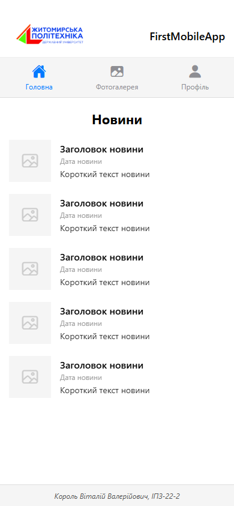
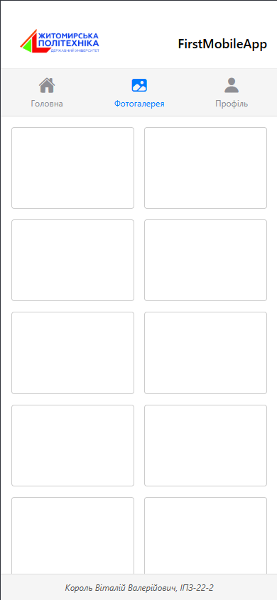
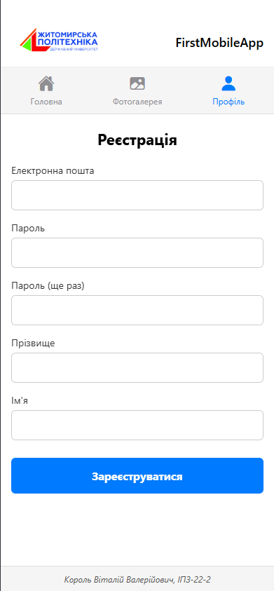

# Лабораторна робота №1
## Тема: Використання Expo для створення найпростішого додатку React Native. Знайомство з основними компонентами.
## Мета: Навчитися створювати та налаштовувати проєкт у середовищі Expo, ознайомитися зі структурою React Native застосунку та опанувати навички роботи з базовими компонентами.
**Студент:** Король Віталій Валерійович
**Група:** ІПЗ-22-2
**Спеціальність:** 121 Інженерія програмного забезпечення
**Навчальний заклад:** Житомирська політехніка

## 📝 Опис проєкту
Цей проєкт є мобільним додатком, розробленим за допомогою фреймворку **React Native** та інструментарію **Expo**. Основна мета роботи — вивчення базових компонентів, налаштування навігації між екранами та робота зі списками даних.

### Реалізована архітектура (6 файлів):
Для забезпечення чистоти коду проєкт розділено на логічні частини:
- **`App.js`** — головна точка входу, конфігурація `Stack Navigation`.
- **`components/Header.js`** — верхня панель з логотипом університету та кнопками навігації.
- **`components/Footer.js`** — нижня панель з інформацією про автора.
- **`screens/HomeScreen.js`** — екран новин із використанням `FlatList`.
- **`screens/GalleryScreen.js`** — екран фотогалереї з сіткою (2 колонки).
- **`screens/ProfileScreen.js`** — екран профілю з формою реєстрації.

## 💻 Інструкція із запуску

1. Встановіть залежності:
   ```bash
   npm install
   ## 🚀 Детальний опис процесу запуску та тестування

Запуск проєкту здійснювався за допомогою інструментарію **Expo CLI**, що дозволяє забезпечити кросплатформенність та швидке тестування. Процес розгортання складався з таких етапів:

### 1. Підготовка середовища 
Для успішного запуску було розгорнуто середовище **Node.js**. Використання терміналу в IDE **PhpStorm** дозволило централізовано керувати процесом встановлення залежностей через пакетний менеджер **npm**.

### 2. Запуск локального сервера 
Виконання команди `npx expo start` ініціалізувало Metro Bundler.

### 3. Тестування на різних платформах:
Під час виконання роботи було перевірено три сценарії відображення:

* **Веб-інтерфейс (клавіша 'w'):** Використовувався як основний метод під час верстки екранів `HomeScreen` та `ProfileScreen`. Для коректної роботи було додатково встановлено пакети `react-native-web` та `react-dom`.
* **Фізичний пристрій (Expo Go):** Фінальне тестування навігації проводилося на реальному смартфоні шляхом сканування QR-коду. Це підтвердило стабільну роботу переходів між екранами через `native-stack` навігатор.


## Скріншоти екранів застосунку

Для підтвердження коректної роботи інтерфейсу та навігації було зроблено скріншоти всіх екранів додатку.

### 1. Головний екран (Новини)



### 2. Фотогалерея



### 3. Профіль (Реєстрація)

