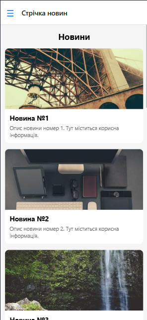
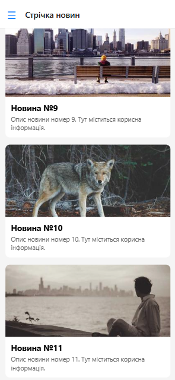
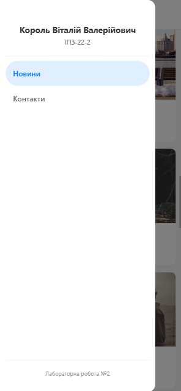
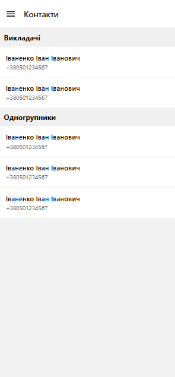

# Лабораторна робота №2

**Тема:** Використання вкладеної навігації (Stack та Drawer) та робота з віртуалізованими списками в React Native.

**Мета:** Навчитися будувати архітектуру мобільного додатка з використанням кількох типів навігації, опанувати роботу з компонентами `FlatList` та `SectionList`, реалізувати механізми Pull-to-Refresh та Infinite Scroll, а також забезпечити стабільну роботу додатка у Web-середовищі.

**Студент:** Король Віталій Валерійович  
**Група:** ІПЗ-22-2  
**Спеціальність:** 121 Інженерія програмного забезпечення  
**Навчальний заклад:** Житомирська політехніка

## Опис проєкту

Цей проєкт демонструє реалізацію сучасного мобільного інтерфейсу для роботи з новинами та контактами. Основна увага приділена оптимізації відображення великих обсягів даних та зручності переходу між екранами.

### Реалізована архітектура (7 основних файлів):

Проєкт має модульну структуру для полегшення підтримки коду:
* **App.js** — точка входу, що обгортає додаток у `NavigationContainer` та `SafeAreaProvider`.
* **src/navigation/AppNavigator.js** — основна логіка навігації: `Drawer.Navigator` (бокове меню) містить у собі `Stack.Navigator` (стрічка новин).
* **src/components/CustomDrawer.js** — кастомний компонент бокового меню з інформацією про автора (ПІБ та група) без використання зовнішніх зображень.
* **src/screens/MainScreen.js** — екран новин із `FlatList`. Реалізовано:
    * **Pull-to-Refresh:** оновлення списку свайпом.
    * **Infinite Scroll:** автоматичне підвантаження нових постів.
    * **Оптимізація:** налаштовані параметри `windowSize` та `initialNumToRender`.
* **src/screens/DetailsScreen.js** — детальний перегляд новини. Використовує динамічне встановлення заголовка через `navigation.setOptions`.
* **src/screens/ContactsScreen.js** — список контактів, реалізований через `SectionList` із групуванням за відділами.
* **src/data/mockData.js** — централізоване сховище тестових даних.

## Скріншоти екранів застосунку

Для підтвердження коректної роботи інтерфейсу, оптимізованих віртуалізованих списків та вкладеної навігації нижче наведено скріншоти ключових екранів розробленого додатка.

### 1. Головний екран (Стрічка новин)
Демонстрація роботи оптимізованого компонента `FlatList`. На екрані відображаються картки новин із зображеннями, заголовком та коротким описом. Інтерфейс успішно адаптовано для Web-версії зі збереженням можливості скролінгу та підвантаження нових елементів (Infinite Scroll).

### 2. Екран деталей новини
Демонстрація роботи `Stack.Navigator` та передачі параметрів між екранами. При натисканні на картку новини дані (фото, заголовок, дата та опис) передаються через `route.params`. Заголовок у верхній панелі навігації також змінюється динамічно відповідно до обраної новини.

### 3. Кастомне бокове меню (Custom Drawer)
Демонстрація власного компонента `Drawer.Navigator`. Стандартне меню замінено на кастомне (`CustomDrawer`): у верхній частині відображаються ПІБ та група автора проєкту, а нижче — пункти переходу між основними екранами. У самому низу додано статичний футер із назвою лабораторної роботи.

### 4. Екран контактів (Списки секціями)
Демонстрація роботи компонента `SectionList`. Дані згруповано за категоріями («Викладачі» та «Одногрупники»). Для кожної секції використовується виділений заголовок, а між елементами списку (ПІБ та телефон) додано тонкі візуальні роздільники (`ItemSeparatorComponent`).

