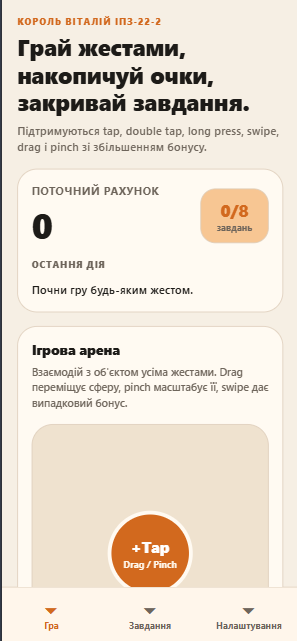
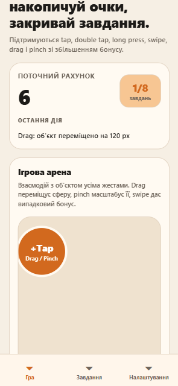
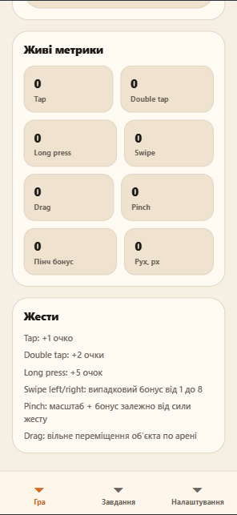
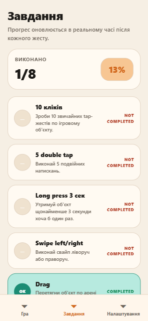
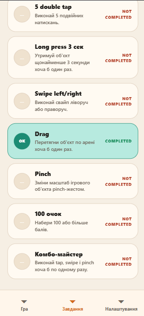
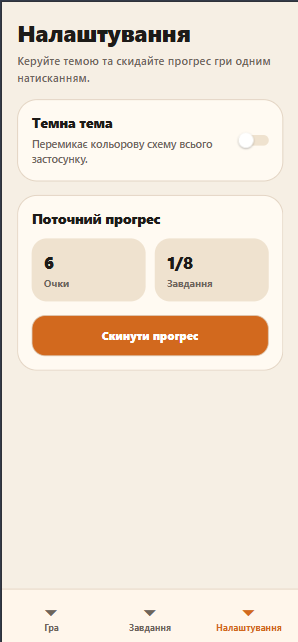
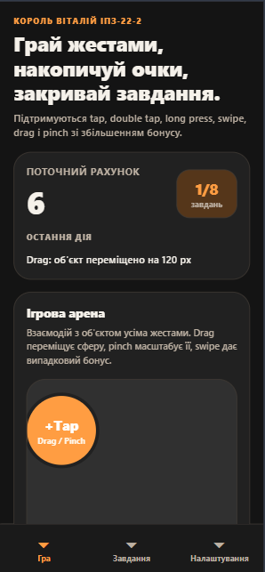

# Лабораторна робота №3
### Тема: Використання кастомних жестів у React Native та стилізація інтерфейсу мобільного застосунку.
### Мета: Навчитися працювати з жестами користувача у мобільному застосунку, реалізувати взаємодію через різні типи жестів та застосувати сучасні підходи стилізації у React Native.

 Це гра-клікер, у якій очки нараховуються через кастомні жести: `tap`, `double tap`, `long press`, `swipe`, `drag` і `pinch`.

## Можливості

- Головний екран з лічильником очок, статистикою та інтерактивним ігровим об'єктом.
- Повна підтримка жестів через `react-native-gesture-handler`.
- Анімоване переміщення та масштабування через `react-native-reanimated`.
- Екран завдань зі статусом `completed / not completed`.
- Екран налаштувань із перемикачем теми та скиданням прогресу.
- Bottom Tabs навігація на базі `@react-navigation/native`.

## Жести

- `Tap` → `+1` очко
- `Double Tap` → `+2` очки
- `Long Press` → `+5` очок
- `Swipe Left / Right` → випадковий бонус від `1` до `8`
- `Drag` → переміщення об'єкта по арені
- `Pinch` → зміна масштабу й бонусні очки залежно від сили жесту

## Завдання

- 10 кліків
- 5 double tap
- long press 3 сек
- swipe left/right
- drag
- pinch
- 100 очок
- власне завдання: `Комбо-майстер` (`tap + swipe + pinch`)

## Встановлення

```bash
npm install
npx expo install @react-navigation/native @react-navigation/bottom-tabs react-native-gesture-handler react-native-reanimated react-native-safe-area-context react-native-screens
```

## Запуск

```bash
npm start
```

Для емулятора або девайса:

```bash
npm run android
npm run ios
```

## Структура проєкту

```text
lab3/
├── App.js
├── README.md
├── babel.config.js
├── package.json
└── src/
    ├── components/
    │   ├── GameArena.js
    │   ├── GestureOrb.js
    │   ├── ScoreBoard.js
    │   ├── SectionCard.js
    │   ├── StatPill.js
    │   └── TaskItem.js
    ├── hooks/
    │   └── useGameState.js
    ├── navigation/
    │   └── AppNavigator.js
    ├── screens/
    │   ├── HomeScreen.js
    │   ├── SettingsScreen.js
    │   └── TasksScreen.js
    └── utils/
        ├── gameHelpers.js
        ├── tasks.js
        └── theme.js
```

## Технічний стек

- Expo
- React Native
- Functional Components + Hooks
- `react-native-gesture-handler`
- `react-native-reanimated`
- `@react-navigation/native`
- `StyleSheet`

## Архітектура

- `useGameState` централізує весь стан гри, статистику, тему та actions через `useReducer`.
- `AppNavigator` відповідає за Bottom Tabs навігацію між трьома екранами.
- `GestureOrb` інкапсулює всю gesture-логіку та анімації.
- `utils/tasks.js` обчислює прогрес завдань на основі поточної статистики.
- UI розбитий на незалежні reusable-компоненти для чистої структури проєкту.

## Скріншоти екранів застосунку

Для підтвердження коректної роботи інтерфейсу, системи обробки жестів (React Native Gesture Handler), управління станом та навігації нижче наведено скріншоти ключових екранів додатка.

### 1. Головний екран (Ігрова арена та метрики)
Демонстрація інтерактивної арени, де користувач взаємодіє з об'єктом за допомогою жестів. 

| Ігрова арена (Старт) | Ігрова арена (В процесі) | Живі метрики |
| :--- | :--- | :--- |
|  |  |  |


### 2. Екран завдань (Progress Tracking)
Візуалізація системи досягнень та трекінгу прогресу користувача.

| Завдання (Верхня частина) | Завдання (Нижня частина) |
| :--- | :--- |
|  |  |


### 3. Налаштування та керування станом
Екран для конфігурації застосунку та скидання ігрових даних.




### 4. Підтримка темної теми (Dark Mode)
Демонстрація адаптивності інтерфейсу під системні налаштування або вибір користувача.


