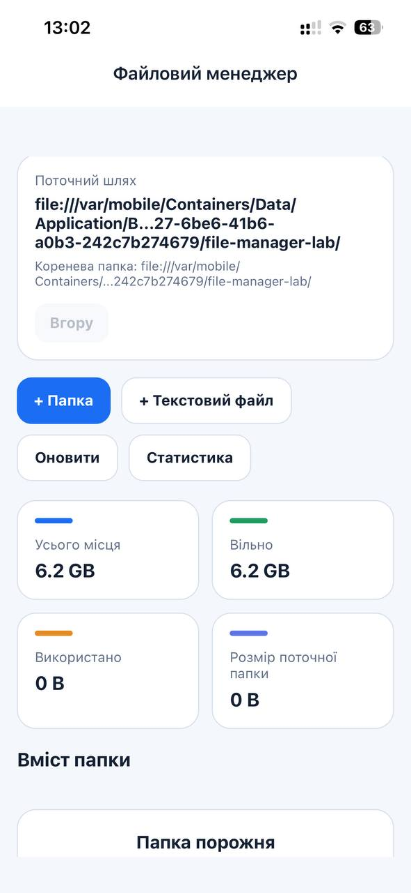
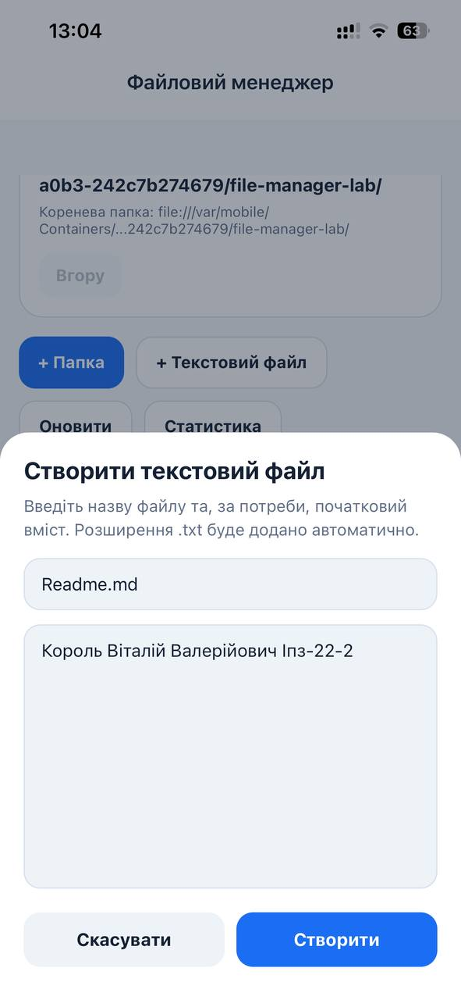
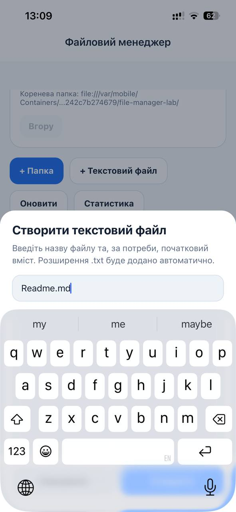
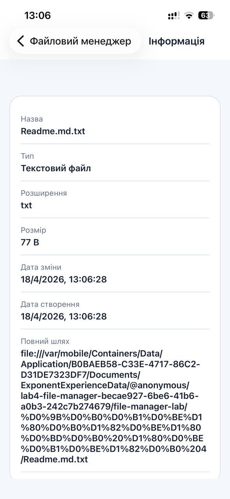
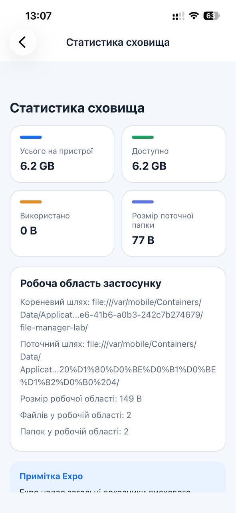
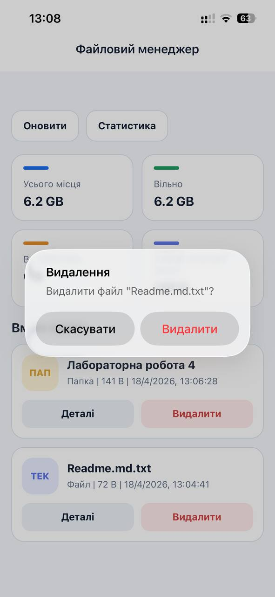

# Лабораторна робота №4
## Тема: Робота з файловою системою в React Native з використанням бібліотеки expo-file-system
## Мета: Опанувати механізми роботи з локальною файловою системою мобільного пристрою, використовуючи можливості бібліотеки expofile-system. Закріпити навички реалізації базових операцій над файлами й папками, організації файлової навігації та аналізу стану файлової системи.
## Команди встановлення

```bash
npm install
npx expo install expo-file-system expo-status-bar react-native-gesture-handler react-native-safe-area-context react-native-screens
npm install @react-navigation/native @react-navigation/native-stack
```

## Реалізовані можливості

- перегляд робочої директорії застосунку
- показ поточного шляху та перехід до батьківської папки
- створення папок
- створення файлів `.txt` з початковим вмістом
- відкриття та читання файлів `.txt`
- редагування й збереження вмісту файлів
- видалення файлів і папок з підтвердженням
- показ детальної інформації про файли та папки
- показ статистики сховища на головному екрані та на окремому екрані статистики
- обробка станів завантаження, порожніх списків, валідації та runtime-помилок

## Запуск

```bash
npx expo start
```

Після цього відкрийте проєкт в Expo Go або запустіть в емуляторі:

```bash
npx expo start --android
npx expo start --ios
```

## Залежності

- `expo`
- `react`
- `react-native`
- `expo-file-system`
- `expo-status-bar`
- `@react-navigation/native`
- `@react-navigation/native-stack`
- `react-native-safe-area-context`
- `react-native-screens`
- `react-native-gesture-handler`

## Структура проєкту

```text
lab4/
  App.js
  app.json
  babel.config.js
  package.json
  README.md
  src/
    components/
      ActionBar.js
      CustomModal.js
      FileListItem.js
      PathHeader.js
      StatCard.js
    constants/
      colors.js
      paths.js
      strings.js
    navigation/
      AppNavigator.js
    screens/
      FileEditorScreen.js
      HomeScreen.js
      ItemDetailsScreen.js
      StatsScreen.js
    services/
      fileSystemService.js
    utils/
      fileHelpers.js
      formatters.js
```

## Екрани

- `HomeScreen`: поточний шлях, коротка статистика, вміст папки, дії створення, навігація між папками
- `FileEditorScreen`: відкриття, читання, редагування та збереження текстового файлу
- `ItemDetailsScreen`: метадані файлу або папки
- `StatsScreen`: розширена статистика сховища для робочої області застосунку

## Архітектура

- `src/services/fileSystemService.js` містить усі операції з файловою системою і приховує деталі `expo-file-system` від UI-коду.
- `src/screens` містить логіку рівня екранів.
- `src/components` містить повторно використовувані презентаційні компоненти.
- `src/utils` містить допоміжні функції для валідації та форматування.
- `src/constants` зберігає кольори теми, рядки інтерфейсу та кореневу директорію застосунку.

## Обмеження Expo

Проєкт використовує сучасний API `File`, `Directory` і `Paths` з `expo-file-system`, що входить до Expo SDK 54 (`~19.0.21`).

У стандартному Expo статистика сховища обмежена значеннями, які надають `Paths.totalDiskSpace` і `Paths.availableDiskSpace`. Через це:

- загальний обсяг пам'яті пристрою показується лише тоді, коли платформа його надає
- доступний вільний простір показується лише тоді, коли платформа його надає
- використаний простір обчислюється як `total - free` лише тоді, коли доступні обидва значення
- застосунок додатково обчислює розмір власної кореневої папки та поточно відкритої папки

Це найкоректніша переносна реалізація в Expo без додавання власних native-модулів.

## Скріншоти

Додайте скріншоти сюди:

- `screenshots/home.png`
- `screenshots/create-file.png`
- `screenshots/editor.png`
- `screenshots/details.png`
- `screenshots/stats.png`


## Скріншоти екранів застосунку

Для підтвердження коректної роботи локальної навігації, операцій із файловою системою через `expo-file-system` та роботи з пам'яттю пристрою нижче наведено скріншоти ключових екранів застосунку.

**1. Головний екран (навігація та вміст директорії)**

Демонструє загальний інтерфейс файлового менеджера. У верхній частині відображаються поточний і кореневий шляхи з кнопкою переходу «Вгору». Нижче розміщено блок короткої статистики пам'яті. Вміст поточної директорії виводиться за допомогою `FlatList`, де файли та папки мають візуальне розділення і кнопки швидких дій «Деталі» та «Видалити».

| Головний екран (порожній) | Головний екран (з файлами) |
| :--- | :--- |
|  |  |

**2. Модальне вікно створення файлу або папки**

Демонструє процес створення нового об'єкта у файловій системі. Використовується модальне вікно з `TextInput` для введення назви файлу, для якого розширення `.txt` додається автоматично, та початкового текстового вмісту. Інтерфейс коректно адаптується під час виклику системної клавіатури.

| Створення файлу | Введення тексту |
| :--- | :--- |
|  |  |

**3. Екран детальної інформації про об'єкт**

Демонструє отримання та відображення метаданих файлу або папки за допомогою сучасного API `File.info()` та `Directory.info()`. На екрані показуються назва, тип, розширення, розмір у байтах, дата створення, дата зміни та повний шлях до об'єкта.



**4. Розширена статистика сховища**

Демонструє окремий екран для аналізу пам'яті. Для розрахунку загального, доступного та використаного простору застосовуються `Paths.totalDiskSpace` і `Paths.availableDiskSpace`. Також додано блок аналізу поточної робочої області застосунку: кількість файлів, папок та їхній сумарний розмір.



**5. Підтвердження видалення**

Демонструє захист від випадкового видалення даних. Після натискання кнопки «Видалити» відкривається системне вікно підтвердження перед фактичним видаленням файлу або папки.


