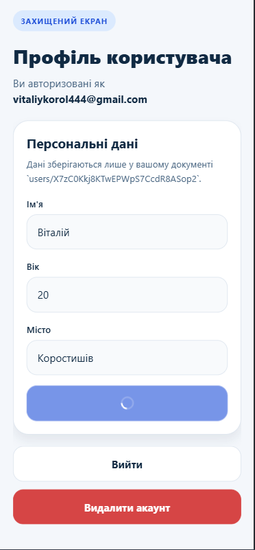
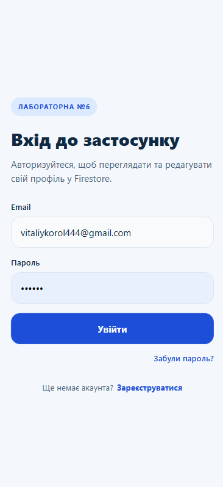
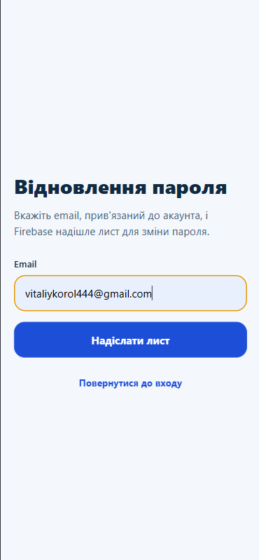
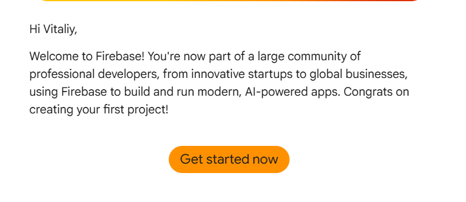
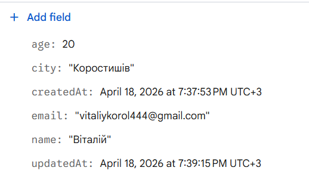

# Лабораторна робота №6
## Тема: Побудова авторизації та збереження персональних даних у React Native з використанням Firebase Authentication та Firestore
## Мета: Набути практичних навичок інтеграції авторизації та обробки персональних даних користувача в мобільному застосунку.

## Короткий опис

Застосунок реалізує:

- реєстрацію нового користувача через email і пароль;
- вхід в існуючий акаунт;
- logout;
- відновлення пароля через email;
- створення, перегляд і редагування профілю;
- збереження персональних даних у Firestore;
- видалення акаунта після повторної автентифікації;
- захищену навігацію через `Expo Router`.

## Інструкція запуску

### Встановлення залежностей

```bash
npm install
npx expo install expo-router react-native-safe-area-context react-native-screens react-native-gesture-handler react-native-reanimated expo-status-bar @react-native-async-storage/async-storage
npm install firebase
```

### Запуск

1. Створіть файл `.env` на основі `.env.example`.
2. Вставте значення Firebase config.
3. Запустіть застосунок:

```bash
npx expo start
```

4. Відкрийте QR-код у `Expo Go`.

##  Список реалізованого функціоналу

- Реєстрація через `Firebase Authentication`.
- Вхід і вихід із системи.
- Відновлення пароля через `sendPasswordResetEmail`.
- Підписка на auth state через `onAuthStateChanged`.
- Захищені маршрути `app/(app)` і гостьові маршрути `app/(auth)`.
- `Redirect` у route layouts для контролю доступу.
- `AuthContext` для централізованого керування авторизацією.
- Збереження профілю в `Firestore` у колекції `users`.
- Документ профілю зберігається як `users/{uid}`.
- Оновлення профілю користувача.
- Клієнтська перевірка доступу лише до власного документа.
- Видалення документа профілю з Firestore.
- Видалення користувача з Firebase Authentication.
- Повторна автентифікація перед видаленням акаунта.

##  Інструкція підключення Firebase

Для запуску потрібно:

1. Створити `Firebase project`.
2. Додати `Web App` у Firebase Console.
3. Увімкнути `Authentication` і провайдер `Email/Password`.
4. Створити `Firestore Database`.
5. Вставити web config у `.env`.
6. Застосувати правила з `firestore.rules`.

### Приклад `.env`

```env
EXPO_PUBLIC_FIREBASE_API_KEY=your_api_key
EXPO_PUBLIC_FIREBASE_AUTH_DOMAIN=your_project.firebaseapp.com
EXPO_PUBLIC_FIREBASE_PROJECT_ID=your_project_id
EXPO_PUBLIC_FIREBASE_STORAGE_BUCKET=your_project.appspot.com
EXPO_PUBLIC_FIREBASE_MESSAGING_SENDER_ID=your_sender_id
EXPO_PUBLIC_FIREBASE_APP_ID=your_app_id
```

##  Які колекції використовуються у Firestore

Використовується колекція:

- `users`

Приклад документа:

```json
{
  "name": "Ім'я користувача",
  "age": 21,
  "city": "Житомир",
  "email": "user@example.com",
  "createdAt": "timestamp",
  "updatedAt": "timestamp"
}
```

ID документа дорівнює `uid` авторизованого користувача.


## Скріншоти роботи застосунку

### 1. Екран реєстрації користувача


Реєстрація нового користувача за допомогою email та пароля через Firebase Authentication.

---

### 2. Завантаження профілю користувача


Після успішної реєстрації відбувається отримання даних користувача з Firestore (документ `users/{uid}`).

---

### 3. Профіль користувача



Екран профілю дозволяє переглядати та редагувати персональні дані (ім’я, вік, місто), які зберігаються у Firestore.

---

### 4. Екран входу



Авторизація існуючого користувача через Firebase Authentication.

---

### 5. Відновлення пароля



Користувач може відновити пароль через email за допомогою Firebase Authentication.

---

### 6. Firebase Authentication



Список зареєстрованих користувачів у Firebase Authentication.

---

### 7. Firestore Database



Збереження персональних даних користувача у колекції `users/{uid}` в Firestore.
##  Висновки

У межах лабораторної роботи реалізовано повний цикл безпечної авторизації та збереження персональних даних у мобільному застосунку на Expo. Комбінація `Expo Router + AuthContext + Firebase Authentication + Firestore` дає зрозумілу архітектуру, сумісну з `Expo Go` і готову до подальшого масштабування.
